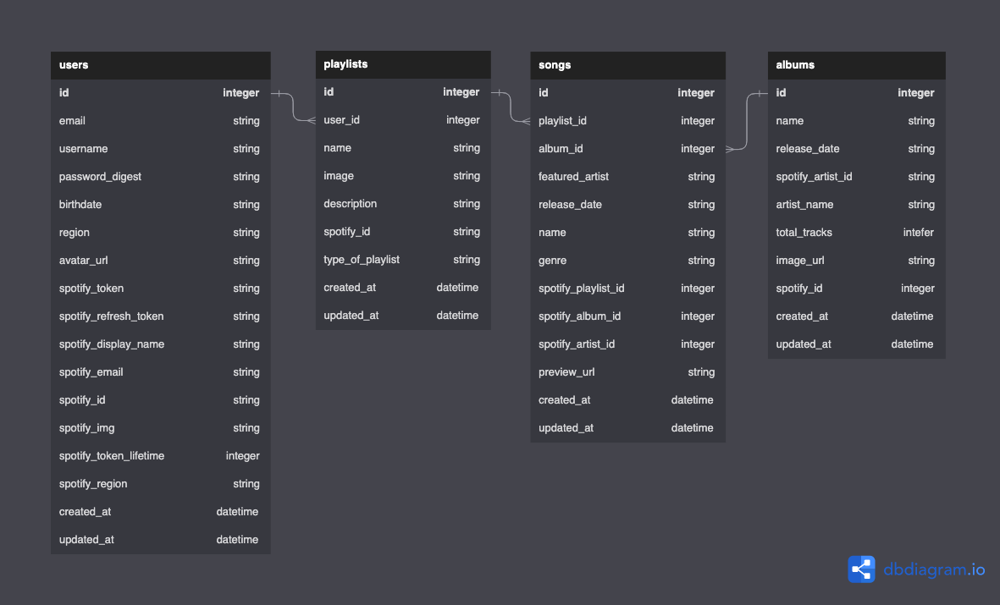
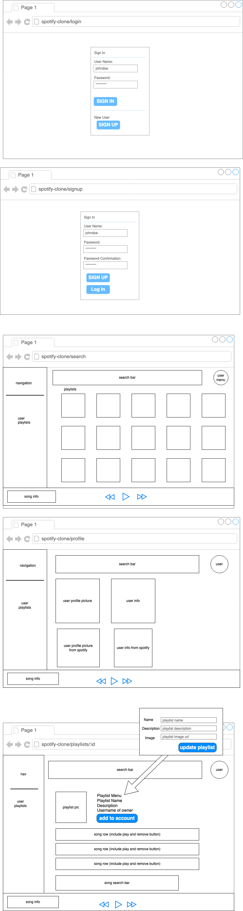

# Spotify Clone (Flatiron Phase 5 Capstone Project)
This project is an attempted clone of some basic Spotify functionality that lets you search for playlists as well as add or remove songs from playlists if it belongs to the logged in user. A logged in user should be able to create a playlist, add songs to it, and save it to Spotify.

## Entity Relationship Model
Each user has many playlists. Each of those playlists has many songs. Each of those songs belongs to an album. Each playlist will have many albums through songs, and each album will have many playlists through songs.


## Wireframes


## SPA Component Tree
```
Index from the src folder
└── App 
  ├── Login
  ├── Navbar
  ├── Search
  ├── Playlist 
  |   └── PlaylistInfo
  |   └── Songs
  ├── Profile 
  └── Song Info & Controls
  ```

### Project Requirements
1. Include a many to many relationship.
2. Implement a minimum of 4 models.
3. Implement a minimum of 5 client side routes using React router.
4. Implement password protection and authentication.
5. Include full CRUD on at least 1 model, following REST conventions.
6. Implement validations and error handling.
7. Implement something new not taught in the curriculum. (Check in with your instructor to ensure the scope of your idea is appropriate.)
8. Implement useContext or Redux.
9. Fully deploy and host your project.

### Fulfilling Requirements
1. Playlists has many albums through songs, and albums has many playlists through songs
2. users, playlists, songs, albums
3. /login, /signup, /search, /profile, /playlists/:id
4. BCrypt
5. Users?
   - Create = Signup
   - Read = Current User’s Profile (Show)
   - Update = Update User Profile
   - Delete = Delete Profile
6. Validate username uniqueness and presence, validate password presence, etc.
7. OAuth
8. userContext
9. Deploy to Render

[GitHub Repository](https://github.com/costabileisa/phase-5-project)